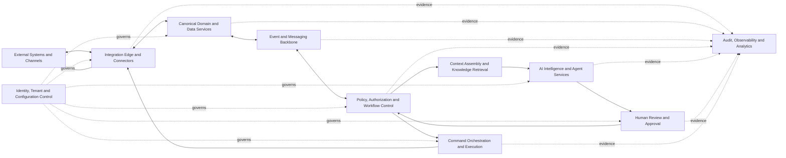

# ASOS System Architecture

**Version:** 1.1.0  
**Status:** Approved Baseline  
**Document Owner:** ASOS Architecture Governance  
**Architecture Type:** Logical, Vendor-Neutral, Multi-Tenant Platform Architecture  
**Applies To:** All ASOS services, AI Agents, workflows, integrations, deployments, and dealership configurations  
**Last Updated:** 2026-08-01  

---

## 1. Purpose and Architectural Scope

This document defines the approved logical architecture of the ASOS AI Sales Operating System.

ASOS is a configurable decision-support and workflow-orchestration platform designed for automotive dealerships, dealer groups, branches, and different technology environments.

This architecture defines:

- Platform boundaries.
- Core architectural components.
- Data ownership and authority boundaries.
- Event, Recommendation, Decision, Command, and Confirmation semantics.
- AI and Agent responsibilities.
- Human Review and approval controls.
- Integration patterns.
- Security and tenant isolation.
- Audit and observability requirements.
- Deployment and configuration principles.
- Architectural evolution and change control.

This document is vendor-neutral.

Specific technologies, cloud providers, AI models, workflow platforms, databases, and Pilot tools must be documented in separate deployment profiles or Architectural Decision Records.

ASOS must remain reusable across dealerships.

Dealership-specific targets, thresholds, workflows, permissions, integrations, commercial policies, and approval limits must remain configurable.

---

## 2. Architectural Drivers and Invariants

All ASOS implementations must preserve the following architectural invariants.

### Constitutional Compliance

Every service, Agent, integration, Prompt, Business Rule, Event, API, Schema, workflow, and dealership configuration must comply with the ASOS Constitution.

### Authorized Human Authority

Binding and high-impact decisions remain under the authority of approved Human roles.

Authority must be enforced through role, permission, scope, threshold, and delegation policies.

### AI Does Not Execute Directly

The AI Intelligence Layer may:

- Analyze.
- Classify.
- Summarize.
- Forecast.
- Match.
- Prioritize.
- Detect risks and opportunities.
- Draft content.
- Generate recommendations and explanations.

The AI Intelligence Layer must not directly perform external actions.

Execution must pass through:

- Deterministic policy controls.
- Authorization controls.
- Required Human Approval or approved automation policy.
- Command Orchestration services.
- Controlled external connectors.

### Evidence Before Assertion

ASOS must distinguish between:

- Authoritative facts.
- Observations.
- Derived Intelligence.
- Assumptions or hypotheses.
- Recommendations.
- Human Decisions.
- Commands.
- External Confirmations.

### Deterministic Control

The following capabilities must not depend solely on probabilistic AI reasoning:

- Authentication.
- Authorization.
- Tenant isolation.
- Required-field validation.
- Financial calculations.
- Approval thresholds.
- Consent controls.
- Data-retention controls.
- Prohibited-action enforcement.
- Command idempotency.
- External-confirmation validation.
- Security policy enforcement.

### Field-Level Authority

Authority must be determined at the field and operation level.

No external or internal system should automatically be treated as the universal System of Record for every field.

### Event-Driven Coordination

Material state changes should produce governed Domain Events that allow authorized services to coordinate without uncontrolled direct dependencies.

### Immutable Event History

Published Events must remain immutable.

An Event must not be silently edited or deleted to change history.

Corrections, reversals, cancellations, and revocations must be represented through new Events linked to the original Event.

### At-Least-Once Delivery Safety

The Event and Messaging Backbone may deliver an Event more than once.

Every Event Consumer must use the Event identifier and idempotent processing controls to prevent duplicate business effects.

### Tenant Isolation

Dealership, branch, User, Customer, Vehicle, Deal, communication, financial, and operational data must remain isolated according to tenant and permission boundaries.

### Auditability

Material recommendations, decisions, approvals, commands, confirmations, overrides, corrections, failures, and outcomes must remain traceable.

### Graceful Degradation

Failure of an AI model or optional integration must not:

- Disable deterministic security controls.
- Disable authorization.
- Break tenant isolation.
- Corrupt authoritative business state.
- Remove audit evidence.

### Modularity

Models, providers, connectors, Agents, workflow components, storage technologies, and infrastructure providers must be replaceable without redefining the ASOS Constitution or Canonical Domain Model.

---

## 3. System Context and Boundaries

ASOS operates between dealership Users and approved external systems.

### Primary Human Users

ASOS may support:

- Sales Consultants.
- Sales Managers.
- General Sales Managers.
- Dealer Principals.
- Executives.
- Finance Specialists.
- Compliance or Legal Reviewers.
- Data Owners.
- System Administrators.
- Approved operational personnel.

### External Systems

ASOS may integrate with:

- Customer Relationship Management systems.
- Dealer Management Systems.
- Inventory Management Systems.
- Finance and Insurance platforms.
- Lender systems.
- Communication providers.
- Website and Lead providers.
- Appointment and calendar platforms.
- Trade-In and valuation providers.
- Pricing and market-data providers.
- Contract and document platforms.
- Payment platforms.
- OEM systems.
- Government or regulatory services.
- Approved spreadsheets and legacy data sources.

### ASOS-Owned State

ASOS may be authoritative for platform-native state such as:

- Recommendations.
- Recommendation status.
- Internal Tasks.
- Human Review requests.
- Human Decisions.
- Approval and rejection evidence.
- Workflow progress.
- Escalations.
- Internal priority queues.
- Agent execution records.
- Outbound Command state.
- Synchronization state.
- Data-quality exceptions.
- Audit evidence.
- Derived Intelligence.

### External Authoritative State

ASOS must not treat an internal projection, recommendation, Human Decision, or outbound Command as externally confirmed unless evidence is received from the configured authoritative source.

Examples may include:

- Final Vehicle availability.
- Final pricing posted in the dealership system.
- Credit or finance approval.
- Contract status.
- Payment status.
- Vehicle reservation.
- Vehicle delivery.
- External Appointment acceptance.
- Final Deal posting.

---

## 4. Logical Architecture

The ASOS logical architecture contains the following major capabilities:



### 4.1 Integration Edge and Connectors

Responsible for:

- Receiving inbound data.
- Sending approved outbound Commands.
- Mapping external identifiers.
- Verifying signatures and credentials.
- Applying rate limits.
- Managing retries.
- Enforcing idempotency.
- Receiving external responses and confirmations.
- Isolating vendor-specific integration behavior.

### 4.2 Canonical Domain and Data Services

Responsible for:

- Canonical Domain Objects.
- Canonical Projections.
- ASOS Authoritative Workflow State.
- Field-level provenance.
- Version and concurrency control.
- Validation.
- Relationship integrity.
- Data-quality status.
- Tenant-aware persistence.
- Reconciliation with authoritative sources.

### 4.3 Event and Messaging Backbone

Responsible for:

- Publishing immutable business Events.
- Assigning unique Event identifiers.
- Delivering Events to authorized Consumers.
- Supporting asynchronous workflows.
- Supporting at-least-once Event delivery.
- Preserving ordering where explicitly required.
- Retry and dead-letter handling.
- Controlled Event replay.
- Correlation and causation tracking.
- Preventing unauthorized Event access.

The Event Backbone must not promise exactly-once physical delivery.

Business-level duplicate prevention must be implemented through idempotent Consumers and controlled state transitions.

### 4.4 Policy, Authorization and Workflow Control

Responsible for deterministic enforcement of:

- Role and permission requirements.
- Approval thresholds.
- Action Classes.
- Consent requirements.
- Business Rule evaluation.
- Workflow transitions.
- Required evidence.
- Escalation.
- Prohibited actions.
- Human Review requirements.
- Approved automation policies.

### 4.5 Context Assembly and Knowledge Retrieval

Responsible for:

- Selecting the minimum necessary context.
- Retrieving approved Business Rules.
- Retrieving approved Playbooks.
- Retrieving relevant Domain Object context.
- Preserving source references.
- Enforcing access restrictions.
- Marking stale or conflicting information.
- Avoiding unnecessary exposure of sensitive information.

### 4.6 AI Intelligence and Agent Services

Responsible for:

- Classification.
- Summarization.
- Forecasting.
- Matching.
- Prioritization.
- Risk detection.
- Opportunity detection.
- Draft generation.
- Recommendation generation.
- Explanation generation.

The term **AI Brain** describes this logical intelligence capability.

It does not require a single model, provider, service, or centralized executable component.

### 4.7 Human Review and Approval

Responsible for:

- Presenting evidence and recommendations.
- Identifying the required Human authority.
- Recording approval, rejection, modification, deferral, or escalation.
- Capturing reasons and decision evidence.
- Enforcing approval expiration.
- Supporting delegation and threshold limits.
- Preventing approval outside configured authority.

### 4.8 Command Orchestration and Execution

Responsible for:

- Converting approved intentions into controlled Commands.
- Validating permissions and approval evidence.
- Validating approved automation policies.
- Enforcing idempotency.
- Selecting the correct connector.
- Tracking Command status.
- Managing retries and failures.
- Waiting for authoritative External Confirmation.
- Preventing duplicate execution.
- Supporting reconciliation.

### 4.9 Audit, Observability and Analytics

Responsible for:

- Immutable audit evidence.
- Operational Logs.
- Distributed tracing.
- Security monitoring.
- Integration health.
- Model and Agent evaluation.
- Workflow metrics.
- Business KPI measurement.
- Incident investigation.
- Pilot and Production reporting.

### 4.10 Identity, Tenant and Configuration Control

This cross-cutting capability governs:

- Authentication.
- User identity.
- Service identity.
- Tenant identity.
- Branch scope.
- Role-based access.
- Attribute-based access.
- Delegation.
- Feature controls.
- Dealership configuration.
- Policy versions.
- Integration configuration.
- Environment configuration.
- Emergency suspension.

---

## 5. Canonical Data and Authority Architecture

ASOS distinguishes between the following categories of information.

### External System-of-Record Data

Information whose authority remains with an approved external system.

Examples may include:

- Final Inventory availability.
- Contract status.
- Payment status.
- Finance approval.
- Final Deal posting.

### ASOS Canonical Projection

A normalized representation of information received from one or more approved sources.

A Canonical Projection improves consistency but does not automatically become the authoritative source.

### ASOS Authoritative Workflow State

State created and governed directly by ASOS.

Examples include:

- Recommendation state.
- Review state.
- Approval state.
- Escalation state.
- Internal Task state.
- Command-processing state.
- Reconciliation state.

### Derived Intelligence

Information calculated, predicted, classified, or generated by ASOS.

Examples include:

- Lead score.
- Deal-risk score.
- Vehicle-match score.
- Churn risk.
- Predicted conversion probability.
- Next-best-action recommendation.

Derived Intelligence must be clearly labeled and versioned.

### Authoritative Human Decision

A decision recorded from a Human with the required:

- Role.
- Permission.
- Scope.
- Approval threshold.
- Delegated authority where applicable.

A Human Decision does not automatically prove that an external system completed the requested action.

### External Confirmation

Evidence received from the configured authoritative source confirming that an external action was accepted or completed.

External Confirmation must remain separate from:

- Recommendation generation.
- Human Approval.
- Command creation.
- Command transmission.

### Data Integrity Requirements

Canonical services must preserve, where applicable:

- `tenant_id`.
- Canonical Object identifier.
- External identifiers.
- Source system.
- Source field.
- Source timestamp.
- Ingestion timestamp.
- Synchronization status.
- Authority classification.
- Record version.
- Conflict status.
- Data-quality status.
- Correlation identifier.
- Causation identifier.

ASOS must not silently overwrite conflicting authoritative values.

Conflicts must be:

- Detected.
- Recorded.
- Classified.
- Resolved through configured policy or Human Review.
- Audited.

---

## 6. Event, Recommendation, Decision, Command, and Confirmation Semantics

ASOS must not use Event, Recommendation, Decision, Command, and Confirmation interchangeably.

### Event

An Event is an immutable statement that something material happened.

Examples:

- `LeadCreated`
- `OpportunityQualified`
- `RecommendationGenerated`
- `RecommendationApproved`
- `CommandSent`
- `CommandFailed`
- `ExternalDealConfirmed`

Events describe past facts.

They do not request future action.

Every Event must have a unique `event_id`.

Relevant Events should also preserve:

- `tenant_id`.
- Event type.
- Event version.
- Aggregate or Domain Object identifier.
- Occurrence timestamp.
- Producer.
- Correlation identifier.
- Causation identifier.
- Actor identity where applicable.

### Event Immutability

A published Event must not be edited to change the historical record.

When an Event contains incorrect information or its effect is later reversed, a new Event must be published.

Examples:

```text
LeadCreated
LeadDataCorrected
```

```text
AppointmentConfirmed
AppointmentConfirmationRevoked
```

The corrective Event must reference the original Event where applicable.

### Event Delivery and Idempotency

The Event Backbone may deliver the same Event more than once.

Every Consumer must:

- Detect previously processed `event_id` values.
- Prevent duplicate state transitions.
- Prevent duplicate Commands.
- Prevent duplicate Customer communication.
- Prevent duplicate reservations, quotations, or external updates.
- Record processing outcomes where required.

Commands that may be retried must use an approved `idempotency_key`.

### Recommendation

A Recommendation is a proposed course of action produced by ASOS.

It must include:

- Supporting evidence.
- Applicable rules.
- Material uncertainty.
- Required approval.
- Expected impact.
- Relevant risks.

A Recommendation is not a Human Decision.

### Human Decision

A Human Decision records that an authorized Human:

- Approved.
- Rejected.
- Modified.
- Deferred.
- Escalated.

The Decision must record:

- Human identity.
- Role and permission scope.
- Decision timestamp.
- Approval threshold where applicable.
- Reason where required.
- Recommendation or action being reviewed.

### Command

A Command requests that a specific action be performed.

Examples:

- `SendApprovedFollowUp`
- `CreateExternalAppointment`
- `UpdateCRMOpportunity`
- `SubmitApprovedQuotation`

A Command may:

- Remain pending.
- Be accepted.
- Be rejected.
- Fail.
- Expire.
- Be cancelled where permitted.
- Require reconciliation.

A successfully transmitted Command is not automatically a completed business action.

### External Confirmation

An External Confirmation records authoritative evidence that an external system accepted or completed an action.

A Command must remain in a pending state until the required authoritative confirmation is received.

Possible Command states may include:

```text
Created
Validated
Awaiting Approval
Approved
Queued
Sent
Pending Confirmation
Confirmed
Rejected
Failed
Expired
Reconciliation Required
Cancelled
```

If confirmation is not received within the configured period, ASOS must not mark the business action as complete.

It must initiate one or more of:

- Timeout handling.
- Status polling.
- Reconciliation.
- Retry where safe.
- Human escalation.
- Incident recording.

### Standard Decision and Execution Flow

```text
External or Internal Change
        ↓
Canonical Projection or Workflow State Updated
        ↓
Immutable Domain Event Published
        ↓
Deterministic Policy Evaluation
        ↓
Context Assembly
        ↓
AI Analysis or Rule-Based Decision Support
        ↓
Recommendation Created
        ↓
Human Review or Pre-Approved Automation Policy
        ↓
Authoritative Decision Recorded
        ↓
Command Created
        ↓
Command Orchestration
        ↓
Command Sent
        ↓
Pending External Confirmation
        ↓
External Confirmation, Rejection, Failure, or Timeout
        ↓
Canonical State Reconciled
        ↓
New Outcome Event Published
        ↓
Audit and Outcome Measurement
```

Not every Event requires AI processing.

Not every Recommendation requires external execution.

Not every internal action requires Human Approval.

The required path depends on:

- Action Class.
- Risk.
- Authority.
- Evidence.
- Dealership configuration.
- Approved automation policy.

---

## 7. AI Intelligence and Agent Architecture

ASOS AI capabilities must operate through governed services.

### Model Gateway

The Model Gateway should provide:

- Provider abstraction.
- Model selection.
- Model version tracking.
- Cost controls.
- Latency controls.
- Availability fallback.
- Safety controls.
- Request and response metadata.
- Approved data-boundary enforcement.

### Prompt and Instruction Registry

Production Prompts and Agent instructions must be:

- Versioned.
- Approved.
- Testable.
- Linked to their use case.
- Linked to structured output Schemas.
- Auditable.
- Reversible.

Prompts remain authoritative in:

```text
03_Prompts/
```

### Context Builder

The Context Builder must:

- Retrieve only authorized information.
- Minimize unnecessary personal data.
- Apply tenant and role boundaries.
- Provide source references.
- Mark stale or conflicting evidence.
- Separate facts from Derived Intelligence.
- Prevent cross-tenant context leakage.

### Specialized Agents

Agents should have narrow and explicit contracts.

Example capabilities may include:

- Lead qualification.
- Opportunity prioritization.
- Vehicle matching.
- Follow-up drafting.
- Appointment support.
- Quotation support.
- Trade-In coordination.
- Finance coordination.
- Deal-risk monitoring.
- Sales Manager assistance.
- Market Intelligence analysis.

Each Agent Contract must define:

- Purpose.
- Inputs.
- Outputs.
- Allowed tools.
- Prohibited actions.
- Required evidence.
- Required approval.
- Action Class.
- Failure behavior.
- Escalation behavior.
- Audit requirements.

### Structured Outputs

Material Agent outputs must use approved structured Schemas.

Outputs must be validated before they affect workflow state.

Invalid or incomplete output must not bypass deterministic controls.

### Explainability

ASOS must provide evidence summaries and decision explanations appropriate to the User and decision risk.

It must not expose:

- Private model internals.
- Hidden chain-of-thought.
- Security-sensitive instructions.
- Secrets.
- Restricted system Prompts.

---

## 8. Human Review and Automation Architecture

Automation must follow the Action Classes established by the Constitution.

### Action Class 0 — Analysis Only

May run automatically.

Examples:

- Summaries.
- Scores.
- Risk detection.
- Recommendation preparation.

These activities must remain traceable.

### Action Class 1 — Internal and Reversible

May run automatically when explicitly permitted by policy.

Examples:

- Internal alerts.
- ASOS Task updates.
- Priority-queue changes.
- Human Review requests.

### Action Class 2 — Controlled External or Customer-Facing

An Action Class 2 operation may proceed through either:

- Explicit Human Approval; or
- A pre-approved automation policy.

A pre-approved automation policy must define:

- Allowed use cases.
- Eligible Customer or workflow conditions.
- Approved templates.
- Approved channels.
- Permitted data fields.
- Frequency limits.
- Time-of-day limits where applicable.
- Consent requirements.
- Approval boundaries.
- Monitoring.
- Revocation.
- Escalation.
- Audit evidence.
- Emergency suspension.

The AI Agent must not grant itself permission to use an automation policy.

The deterministic Policy and Authorization layer must validate that the proposed action remains within the approved policy.

### Action Class 3 — Binding or High-Impact

Requires an authorized Human Decision.

Where applicable, it also requires authoritative confirmation from the external System of Record.

Examples may include:

- Final pricing approval.
- Discount approval beyond delegated limits.
- Credit or finance decisions.
- Trade-In valuation approval.
- Contractual commitments.
- Legal representations.
- Final Deal approval.
- Payment authorization.
- Vehicle delivery authorization.
- Material changes to Customer rights or obligations.

### Approval Controls

Approval services must support:

- Required role.
- Permission scope.
- Value threshold.
- Branch or dealership scope.
- Delegation.
- Separation of duties.
- Expiration.
- Revocation.
- Multi-step approval.
- Rejection reason.
- Override reason.
- Escalation.
- Emergency suspension.

A Human must not be able to approve an action outside their configured authority merely because the interface displays the approval option.

---

## 9. Integration and External-System Architecture

ASOS integrations must use adapter and connector boundaries.

Core services must not depend directly on vendor-specific payloads.

### Inbound Integration Patterns

Supported patterns may include:

- Webhooks.
- Event streams.
- REST APIs.
- GraphQL APIs.
- Scheduled polling.
- Batch imports.
- Secure file exchange.
- Approved manual imports.

### Outbound Integration Patterns

Approved Commands may be sent through:

- REST or GraphQL APIs.
- Event or message publishing.
- Secure file export.
- Provider-specific SDKs.
- Approved browser or workflow automation where no reliable API exists.

### Connector Requirements

Each connector must define:

- Authentication method.
- Tenant mapping.
- External identifier mapping.
- Supported Objects and fields.
- Read permissions.
- Write permissions.
- Field-level authority.
- Rate limits.
- Retry policy.
- Idempotency behavior.
- Timeout behavior.
- Error mapping.
- Confirmation behavior.
- Reconciliation process.
- Security classification.

### Synchronization

ASOS may support controlled bidirectional integration where required.

Bidirectional integration does not mean unrestricted write access.

Every write operation must be explicitly authorized.

### Command Confirmation

A connector response indicating successful receipt does not necessarily represent completion of the requested business action.

The connector must distinguish where possible between:

- Transport success.
- Request acceptance.
- Processing completion.
- Authoritative business confirmation.

### Failure Handling

Integration failures must support:

- Retry with backoff.
- Idempotency.
- Dead-letter handling.
- Alerting.
- Human escalation.
- Reconciliation.
- Audit evidence.
- Safe recovery.

A failed or delayed synchronization must not be hidden.

---

## 10. Security, Privacy, and Multi-Tenancy Architecture

Security is a cross-cutting architectural responsibility.

### Identity and Authentication

ASOS must support:

- Strong User authentication.
- Service authentication.
- Session protection.
- Token validation.
- Multi-factor authentication where required.
- Identity-provider integration where appropriate.

### Authorization

Authorization must consider:

- Tenant.
- Dealership.
- Branch.
- Role.
- Permission.
- Resource.
- Action.
- Value threshold.
- Delegation.
- Data classification.
- Workflow state.

### Tenant Isolation

Tenant isolation must apply to:

- Databases.
- Object storage.
- Search indexes.
- Vector stores.
- Caches.
- Event streams.
- Logs.
- Analytics.
- AI context.
- Backups.
- Support access.

### Privacy

ASOS must support:

- Data minimization.
- Purpose limitation.
- Consent enforcement.
- Communication preferences.
- Retention rules.
- Deletion or anonymization.
- Sensitive-field masking.
- Restricted AI context.
- Regional or contractual data requirements.

### Secrets and Credentials

Secrets must not be stored in:

- Source code.
- GitHub documentation.
- Prompts.
- Logs.
- Agent outputs.
- Unprotected configuration files.

Secrets must be managed through approved secret-management services.

### Security Monitoring

ASOS must detect and record:

- Unauthorized access attempts.
- Cross-tenant access attempts.
- Permission violations.
- Suspicious Agent activity.
- Connector abuse.
- Data-exfiltration risks.
- Prompt-injection attempts.
- Policy-bypass attempts.
- Administrative changes.

---

## 11. Reliability, Observability, Audit, and Recovery

ASOS must provide both technical and business observability.

### Technical Observability

The platform should monitor:

- Availability.
- Latency.
- Error rates.
- Queue depth.
- Event delivery.
- Duplicate Event delivery.
- Consumer processing failures.
- Connector health.
- Database health.
- Model availability.
- Model latency.
- Token and cost usage.
- Retry behavior.
- Dead-letter volume.
- Confirmation timeouts.

### Business Observability

The platform should monitor:

- Lead response time.
- Workflow progression.
- Approval delays.
- Recommendation acceptance.
- Human overrides.
- Command success.
- External Confirmation delays.
- Data-quality exceptions.
- Lost-opportunity risk.
- Inventory and Deal outcomes.

### Audit Evidence

Material activity should record:

- Tenant.
- User or service.
- Role and permission.
- Domain Object.
- Event and `event_id`.
- Event version.
- Correlation identifier.
- Causation identifier.
- Recommendation.
- Business Rule version.
- Prompt version.
- Model version.
- Human Decision.
- Approval evidence.
- Command and idempotency key.
- Connector response.
- External Confirmation.
- Correction or reversal Event.
- Error.
- Timestamp.

### Reliability Controls

ASOS should support:

- Idempotent Event Consumers.
- Idempotent Commands.
- Safe retries.
- Circuit breakers.
- Timeouts.
- Backpressure.
- Dead-letter queues.
- Health checks.
- Graceful degradation.
- Backup and restore.
- Disaster recovery.
- Controlled Event replay.
- Reconciliation.
- Rollback.

AI unavailability must not disable:

- Authentication.
- Authorization.
- Tenant isolation.
- Deterministic workflow controls.
- Audit recording.
- Emergency suspension.

---

## 12. Deployment, Configuration, and Architectural Evolution

### Deployment Models

ASOS may support:

- Multi-tenant Software-as-a-Service.
- Dedicated tenant deployment.
- Private-cloud deployment.
- Hybrid deployment.
- Region-specific deployment.

The logical architecture must remain consistent across deployment models.

### Configuration Hierarchy

Configuration may be applied at the following levels:

1. Platform.
2. Market or regulatory region.
3. Dealer group.
4. Dealership.
5. Branch.
6. Department.
7. Role.
8. User.
9. Workflow or use case.
10. Pilot or controlled rollout.

Lower-level configuration must not override higher-level legal, constitutional, security, or tenant-isolation requirements.

### Feature Controls

ASOS should support:

- Feature flags.
- Pilot scope controls.
- Branch rollout controls.
- Agent enablement.
- Connector enablement.
- Automation limits.
- Model selection.
- Approval thresholds.
- Emergency disablement.

### Technology Profiles

Vendor-specific technologies must be recorded separately.

A deployment profile may document:

- Cloud provider.
- Database.
- Event platform.
- Workflow engine.
- AI model providers.
- Vector database.
- Monitoring platform.
- Communication providers.
- Integration tools.

Changing a vendor should not require redefining the ASOS Constitution or Canonical Domain Model.

### Architectural Decisions

Material decisions must be documented through Architectural Decision Records.

An ADR should include:

- Decision.
- Context.
- Alternatives.
- Rationale.
- Consequences.
- Security impact.
- Data impact.
- Migration impact.
- Approval.
- Status.

### Change Control

Breaking architectural changes require:

- Impact assessment.
- Constitution review.
- Domain Model impact review.
- Event and API impact review.
- Security and privacy review.
- Migration plan.
- Compatibility plan.
- Testing.
- Approval.
- Versioning.
- Rollback plan.

### Controlled Build Sequence

The recommended build sequence is:

1. Constitution and governance.
2. Data ownership and Systems of Record.
3. Canonical Domain Model.
4. Logical System Architecture.
5. Canonical Event Catalog.
6. API and Integration Contracts.
7. Canonical Data Schemas.
8. AI Agent Contracts.
9. Business Rules and Playbook alignment.
10. Controlled MVP implementation.
11. Pilot evaluation.
12. Governed expansion.

---

## Governing Documents

- [ASOS Constitution](../00_Constitution/Constitution.md)
- [ASOS Data Ownership and Systems of Record](./Data_Ownership_and_Systems_of_Record.md)
- [ASOS Canonical Domain Model](../07_Knowledge_Base/docs/01-Domain-Model/)
- [ASOS MVP Pilot Framework](./MVP_Pilot_Framework.md)
- [ASOS Repository Structure](../README.md)

---

## Current Status

This document is the approved logical architecture baseline for ASOS.

Vendor-specific deployment choices, infrastructure products, AI providers, and dealership-specific configuration must be documented separately.
