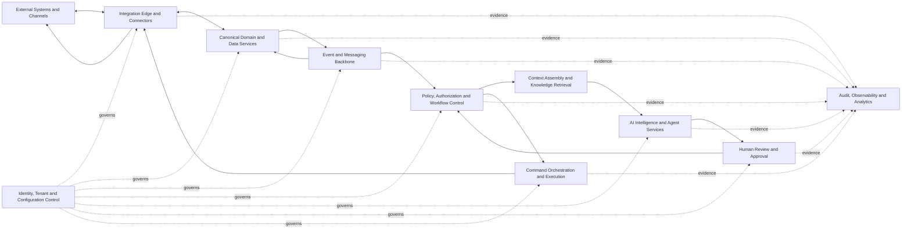

# ASOS System Architecture

**Version:** 1.1.0  
**Status:** Approved Baseline  
**Document Owner:** ASOS Architecture Governance  
**Architecture Type:** Logical, Vendor-Neutral, Multi-Tenant Platform Architecture  
**Applies To:** All ASOS services, AI Agents, workflows, integrations, deployments, and dealership configurations  
**Last Updated:** 2026-08-02  

---

## 1. Purpose and Architectural Scope

This document defines the approved logical architecture of the ASOS AI Sales Operating System.

ASOS is a configurable decision-support and workflow-orchestration platform designed for automotive dealerships, dealer groups, branches, and different technology environments.

This architecture defines:

- Platform boundaries.
- Core architectural capabilities.
- Data ownership and authority boundaries.
- Event, Recommendation, Decision, Command, and Confirmation semantics.
- Event identity ownership and delivery responsibilities.
- AI and Agent responsibilities.
- Human Review and approval controls.
- Integration patterns.
- Security and Tenant isolation.
- Audit, observability, reliability, and recovery requirements.
- Deployment and configuration principles.
- Architectural evolution and change control.

This document is vendor-neutral.

Specific technologies, cloud providers, AI models, workflow platforms, databases, messaging platforms, and Pilot tools must be documented in separate deployment profiles or Architectural Decision Records.

ASOS must remain reusable across dealerships.

Dealership-specific targets, thresholds, workflows, permissions, integrations, commercial policies, and approval limits must remain configurable.

---

## 2. Architectural Drivers and Invariants

All ASOS implementations must preserve the following architectural invariants.

### Constitutional Compliance

Every service, Agent, integration, Prompt, Business Rule, Event, API, Schema, workflow, and dealership configuration must comply with the ASOS Constitution.

### Authorized Human Authority

Binding and high-impact Decisions remain under the authority of approved Human roles.

Authority must be enforced through:

- Role.
- Permission.
- Tenant scope.
- Dealership and branch scope.
- Monetary or risk threshold.
- Delegation.
- Separation of duties.
- Approval validity.
- Revocation.

### AI Does Not Execute Directly

The AI Intelligence Layer may:

- Analyze.
- Classify.
- Summarize.
- Forecast.
- Match.
- Prioritize.
- Detect risks and opportunities.
- Draft content.
- Generate Recommendations.
- Generate explanations.

The AI Intelligence Layer must not directly perform external actions.

Execution must pass through:

- Deterministic policy controls.
- Authentication and authorization.
- Required Human Approval or approved automation policy.
- Command Orchestration.
- Controlled external connectors.
- Required External Confirmation.
- Audit and reconciliation.

### Evidence Before Assertion

ASOS must distinguish between:

- Authoritative facts.
- External observations.
- Canonical Projections.
- ASOS Authoritative Workflow State.
- Derived Intelligence.
- Assumptions or hypotheses.
- Recommendations.
- Human Decisions.
- Commands.
- External Confirmations.
- Reconciled canonical outcomes.

### Deterministic Control

The following capabilities must not depend solely on probabilistic AI reasoning:

- Authentication.
- Authorization.
- Tenant isolation.
- Required-field validation.
- Financial calculations.
- Approval thresholds.
- Consent controls.
- Data-retention controls.
- Prohibited-action enforcement.
- Lifecycle transition validation.
- Event-envelope validation.
- Event identity validation.
- Consumer deduplication.
- Command idempotency.
- External-confirmation validation.
- Security policy enforcement.

### Field-Level Authority

Authority must be determined at the field and operation level.

No external or internal system should automatically be treated as the universal System of Record for every field.

### Event-Driven Coordination

Material state changes should produce governed Domain or Workflow Events that allow authorized services to coordinate without uncontrolled direct dependencies.

### Producer-Owned Event Identity

Every canonical Event must receive its immutable `event_id` from the approved Event-producing boundary before the Event is published.

The Event and Messaging Backbone must preserve that identifier unchanged.

It must not create a replacement identifier for an already-created canonical Event.

### Immutable Event History

Published Events must remain immutable.

An Event must not be silently edited or deleted to change history.

Corrections, reversals, cancellations, and revocations must be represented through new Events linked to the original Event.

### At-Least-Once Delivery Safety

The Event and Messaging Backbone may deliver the same Event more than once.

Every Event Consumer must use the preserved `event_id` and idempotent processing controls to prevent duplicate business effects.

### Tenant Isolation

Dealership, branch, User, Customer, Vehicle, Deal, communication, financial, and operational data must remain isolated according to Tenant and permission boundaries.

### Auditability

Material Recommendations, Decisions, approvals, Commands, Confirmations, overrides, corrections, failures, and outcomes must remain traceable.

### Graceful Degradation

Failure of an AI model or optional integration must not:

- Disable deterministic security controls.
- Disable authorization.
- Break Tenant isolation.
- Corrupt authoritative business state.
- Rewrite Event identity.
- Remove audit evidence.

### Modularity

Models, providers, connectors, Agents, workflow components, storage technologies, and infrastructure providers must be replaceable without redefining the ASOS Constitution or Canonical Domain Model.

---

## 3. System Context and Boundaries

ASOS operates between dealership Users and approved external systems.

### Primary Human Users

ASOS may support:

- Sales Consultants.
- Sales Managers.
- General Sales Managers.
- Dealer Principals.
- Executives.
- Finance Specialists.
- Compliance or Legal Reviewers.
- Inventory personnel.
- Delivery personnel.
- Accounting personnel.
- Data Owners and Data Stewards.
- System Administrators.
- Approved operational personnel.

### External Systems

ASOS may integrate with:

- Customer Relationship Management systems.
- Dealer Management Systems.
- Inventory Management Systems.
- Finance and Insurance platforms.
- Lender and bank systems.
- Communication providers.
- Website and Lead providers.
- Appointment and calendar platforms.
- Trade-In and valuation providers.
- Pricing and market-data providers.
- Contract and document platforms.
- Payment platforms.
- Delivery systems.
- OEM systems.
- Government or regulatory services.
- Approved spreadsheets and legacy data sources.

### ASOS-Owned State

ASOS may be authoritative for platform-native state such as:

- Recommendations.
- Recommendation status.
- Internal Tasks.
- Human Review requests.
- Human Decisions.
- Approval and rejection evidence.
- Workflow progress.
- Escalations.
- Internal priority queues.
- Agent execution records.
- Outbound Command state.
- Event publication state.
- Consumer-processing state.
- Synchronization state.
- Data-quality exceptions.
- Reconciliation state.
- Audit evidence.
- Derived Intelligence.

### External Authoritative State

ASOS must not treat an internal projection, Recommendation, Human Decision, outbound Command, or provider acknowledgement as externally confirmed unless accepted evidence is received from the configured authoritative source.

Examples may include:

- Final Vehicle availability.
- External Inventory stock posting.
- Final pricing posted in the dealership system.
- Credit or finance approval.
- Contract status.
- Payment status.
- Funding outcome.
- Vehicle Reservation.
- Vehicle delivery.
- External Appointment acceptance.
- Registration.
- Final Deal posting.
- Accounting outcome.

---

## 4. Logical Architecture

The ASOS logical architecture contains the following major capabilities:



### 4.1 Integration Edge and Connectors

Responsible for:

- Receiving inbound data and external Events.
- Sending approved outbound Commands.
- Mapping external identifiers.
- Preserving external source identifiers.
- Creating normalized external-observation records.
- Acting as the approved Event Producer for normalized integration Events where configured.
- Assigning the ASOS `event_id` for each new normalized Event it produces.
- Preserving the external provider Event identifier separately, such as `source_event_id` or `external_event_id`.
- Verifying signatures and credentials.
- Applying rate limits.
- Managing retries.
- Enforcing idempotency.
- Receiving external responses and Confirmations.
- Isolating vendor-specific integration behavior.

An external provider identifier must not replace the ASOS canonical `event_id`.

A retry of the same normalized Event must retain the same ASOS `event_id`.

A materially new external occurrence requires a new ASOS `event_id`.

### 4.2 Canonical Domain and Data Services

Responsible for:

- Canonical Domain Objects.
- Canonical Projections.
- ASOS Authoritative Workflow State.
- Field-level provenance.
- Version and concurrency control.
- Validation.
- Relationship integrity.
- Data-quality status.
- Tenant-aware persistence.
- Reconciliation with authoritative sources.
- Creating Domain and Workflow Event records for accepted material occurrences.
- Assigning each new Event its immutable `event_id` before publication.
- Persisting the Event atomically with the accepted state change or through an approved transactional-outbox pattern.
- Publishing the created Event without changing its identity.
- Preserving correlation, causation, authority, evidence, and aggregate version.

The responsible Domain or Workflow Service is the approved Event-producing boundary for the facts it owns unless the Event Catalog explicitly assigns another Producer.

### 4.3 Event and Messaging Backbone

Responsible for:

- Accepting immutable Events created by approved Producers.
- Validating required Event-envelope fields.
- Validating that `event_id` is present, correctly formed, and not reused for another occurrence.
- Preserving the Producer-assigned `event_id` unchanged.
- Delivering Events to authorized Consumers.
- Supporting asynchronous workflows.
- Supporting at-least-once Event delivery.
- Preserving ordering where explicitly required.
- Retry and dead-letter handling.
- Controlled Event replay.
- Correlation and causation propagation.
- Tenant-aware routing and authorization.
- Preventing unauthorized Event access.
- Recording publication and delivery evidence.

The Event Backbone must not:

- Mint the canonical `event_id` for a Domain or Workflow Event that has already been created by its Producer.
- Rewrite `event_id` during transport, retry, redelivery, dead-letter processing, or replay.
- Reuse an `event_id` for a different occurrence.
- Treat transport metadata as canonical Event identity.
- Promise exactly-once physical delivery.

When an Event is missing a valid identity or conflicts with an existing Event identity, the Backbone must reject, quarantine, or route the Event for reconciliation according to policy.

Business-level duplicate prevention must be implemented through idempotent Consumers and controlled state transitions.

### 4.4 Policy, Authorization and Workflow Control

Responsible for deterministic enforcement of:

- Role and permission requirements.
- Approval thresholds.
- Action Classes.
- Consent requirements.
- Business Rule evaluation.
- Workflow transitions.
- Required evidence.
- Escalation.
- Prohibited actions.
- Human Review requirements.
- Approved automation policies.
- Event-trigger eligibility.
- Replay eligibility.
- Correction and reversal authority.

### 4.5 Context Assembly and Knowledge Retrieval

Responsible for:

- Selecting the minimum necessary context.
- Retrieving approved Business Rules.
- Retrieving approved Playbooks.
- Retrieving relevant Domain Object context.
- Preserving source references.
- Enforcing access restrictions.
- Marking stale or conflicting information.
- Avoiding unnecessary exposure of sensitive information.
- Preserving the record and Event versions used for AI analysis.

### 4.6 AI Intelligence and Agent Services

Responsible for:

- Classification.
- Summarization.
- Forecasting.
- Matching.
- Prioritization.
- Risk detection.
- Opportunity detection.
- Draft generation.
- Recommendation generation.
- Explanation generation.

The term **AI Brain** describes this logical intelligence capability.

It does not require a single model, provider, service, or centralized executable component.

AI Agents may produce Agent-run, analysis, Recommendation, anomaly, or Derived Intelligence Events only through an approved producing boundary.

They must not impersonate an authoritative Domain Producer.

### 4.7 Human Review and Approval

Responsible for:

- Presenting evidence and Recommendations.
- Identifying the required Human authority.
- Recording approval, rejection, modification, deferral, or escalation.
- Capturing reasons and Decision evidence.
- Enforcing approval expiration.
- Supporting delegation and threshold limits.
- Preventing approval outside configured authority.
- Producing governed Human Decision Events through the approved Decision Service boundary.

### 4.8 Command Orchestration and Execution

Responsible for:

- Converting approved intentions into controlled Commands.
- Validating permissions and approval evidence.
- Validating approved automation policies.
- Enforcing idempotency.
- Selecting the correct connector.
- Tracking Command status.
- Managing retries and failures.
- Waiting for authoritative External Confirmation.
- Preventing duplicate execution.
- Supporting reconciliation.
- Producing Command lifecycle Events through the approved Command Service boundary.

A Command identifier and an Event identifier are separate.

A Command retry may retain the same Command and idempotency identity while each new material Command lifecycle occurrence receives its own Event record and `event_id`.

### 4.9 Audit, Observability and Analytics

Responsible for:

- Immutable audit evidence.
- Operational Logs.
- Distributed tracing.
- Security monitoring.
- Integration health.
- Event publication and delivery health.
- Event identity conflicts.
- Consumer deduplication outcomes.
- Model and Agent evaluation.
- Workflow metrics.
- Business KPI measurement.
- Incident investigation.
- Pilot and Production reporting.

### 4.10 Identity, Tenant and Configuration Control

This cross-cutting capability governs:

- Authentication.
- User identity.
- Service identity.
- Tenant identity.
- Branch scope.
- Role-based access.
- Attribute-based access.
- Delegation.
- Feature controls.
- Dealership configuration.
- Policy versions.
- Integration configuration.
- Environment configuration.
- Event routing authorization.
- Replay authorization.
- Emergency suspension.

---

## 5. Canonical Data and Authority Architecture

ASOS distinguishes between the following categories of information.

### External System-of-Record Data

Information whose authority remains with an approved external system.

Examples may include:

- Final external Inventory availability.
- External stock posting.
- Contract status.
- Payment status.
- Finance or funding outcome.
- Registration.
- Final Deal posting.
- Accounting outcome.

### ASOS Canonical Projection

A normalized representation of information received from one or more approved sources.

A Canonical Projection improves consistency but does not automatically become the authoritative source.

### ASOS Authoritative Workflow State

State created and governed directly by ASOS.

Examples include:

- Recommendation state.
- Review state.
- Approval state.
- Escalation state.
- Internal Task state.
- Command-processing state.
- Event-publication state.
- Consumer-processing state.
- Reconciliation state.

### Derived Intelligence

Information calculated, predicted, classified, or generated by ASOS.

Examples include:

- Lead score.
- Deal-risk score.
- Vehicle-match score.
- Churn risk.
- Predicted conversion probability.
- Next-best-action Recommendation.

Derived Intelligence must be clearly labeled and versioned.

### Authoritative Human Decision

A Decision recorded from a Human with the required:

- Role.
- Permission.
- Scope.
- Approval threshold.
- Delegated authority where applicable.

A Human Decision does not automatically prove that an external system completed the requested action.

### External Confirmation

Evidence received from the configured authoritative source confirming that an external action was accepted, rejected, completed, reversed, or otherwise resolved.

External Confirmation must remain separate from:

- Recommendation generation.
- Human Approval.
- Command creation.
- Command transmission.
- Provider transport acknowledgement.

### Data Integrity Requirements

Canonical services must preserve, where applicable:

- `tenant_id`.
- Canonical Object identifier.
- External identifiers.
- Source system.
- Source field.
- Source timestamp.
- Ingestion timestamp.
- Synchronization status.
- Authority classification.
- Record version.
- Conflict status.
- Data-quality status.
- `event_id`.
- Correlation identifier.
- Causation identifier.
- Evidence references.

ASOS must not silently overwrite conflicting authoritative values.

Conflicts must be:

- Detected.
- Recorded.
- Classified.
- Resolved through configured policy or Human Review.
- Audited.

---

## 6. Event, Recommendation, Decision, Command, and Confirmation Semantics

ASOS must not use Event, Recommendation, Decision, Command, and Confirmation interchangeably.

### Event

An Event is an immutable statement that one material occurrence happened.

Examples:

- `LeadCreated`
- `OpportunityQualified`
- `RecommendationGenerated`
- `RecommendationApproved`
- `CommandSent`
- `CommandFailed`
- `ExternalDealConfirmed`

Events describe past facts.

They do not request future action.

Every Event must have one globally unique immutable `event_id`.

Relevant Events must preserve the approved Canonical Event envelope, including where applicable:

- `event_id`.
- `event_type`.
- `event_version`.
- `tenant_id`.
- Occurrence timestamp.
- Recording timestamp.
- Producer and Producer version.
- Aggregate or governed workflow identifier.
- Aggregate version.
- Authority category.
- Source system.
- Actor identity.
- Correlation identifier.
- Causation identifier.
- Payload Schema reference.
- Data classification.
- Evidence references.
- Event-specific payload.

### Event Identity Ownership

The approved Event-producing boundary owns creation of the canonical Event record and assignment of its `event_id`.

The producing boundary may be:

- A Canonical Domain Service.
- A Workflow Service.
- A Human Decision Service.
- Command Orchestration.
- An approved integration adapter producing a normalized external observation or Confirmation Event.
- An approved AI or analytics service producing a permitted Agent-run or Derived Intelligence Event.
- Another Producer explicitly approved by the Canonical Event Catalog.

The Producer must assign `event_id`:

- After it has determined that a material occurrence is accepted.
- Before publication to the Event Backbone.
- Before any retryable publication attempt.
- In the same trusted transaction as the accepted state change where technically possible.
- Otherwise through an approved transactional-outbox mechanism.

The Event Backbone owns transport and delivery, not Event identity creation.

### Event Identifier Rules

`event_id` must:

- Be globally unique.
- Be immutable.
- Identify one material occurrence.
- Never be reused for another occurrence.
- Remain unchanged during publication retry.
- Remain unchanged during redelivery.
- Remain unchanged while stored in a dead-letter mechanism.
- Remain unchanged during authorized replay of the same Event.
- Support reliable Consumer deduplication.
- Be auditable back to the Producer and creation transaction.

A correction, reversal, cancellation, revocation, or supersession is a new occurrence.

It therefore requires a new Event and a new `event_id`.

The new Event must link to the affected Event through approved references such as:

- `original_event_id`.
- `corrected_event_id`.
- `reversed_event_id`.
- `cancelled_event_id`.
- `revoked_event_id`.
- `superseded_event_id`.

### External Event Identifiers

An external provider may supply its own Event, message, webhook, transaction, or observation identifier.

The Integration Edge must preserve that value separately, for example:

- `source_event_id`.
- `external_event_id`.
- `source_message_id`.
- `source_transaction_id`.

The normalized ASOS Event must still receive an ASOS canonical `event_id` from the approved integration Producer.

The same external occurrence must not generate multiple normalized Events merely because delivery was retried.

A provider reusing the same identifier for materially different payloads must create a security or reconciliation condition.

### Event Immutability

A published Event must not be edited to change the historical record.

When an Event contains incorrect information or its effect is later reversed, a new Event must be published.

Examples:

```text
LeadCreated
LeadDataCorrected
```

```text
AppointmentConfirmed
AppointmentConfirmationRevoked
```

```text
ExternalFundingConfirmed
FundingReversed
```

The corrective Event must reference the affected Event where applicable.

### Event Publication

The Producer must persist:

- Event identity.
- Event type and version.
- Tenant.
- Subject and aggregate version.
- Authority.
- Occurrence time.
- Correlation and causation.
- Payload.
- Evidence references.
- Publication state.

The recommended pattern is:

```text
Authoritative state change accepted
        ↓
Event record and event_id created transactionally
        ↓
Outbox record committed
        ↓
Publisher sends the unchanged Event
        ↓
Backbone validates and transports the Event
        ↓
Publisher records publication result
```

A database commit without a corresponding required Event must be detectable and recoverable.

An Event must not be published before the underlying accepted occurrence is durably recorded unless an approved architecture explicitly guarantees equivalent consistency.

### Event Delivery and Consumer Idempotency

The Event Backbone may deliver the same Event more than once.

Every Consumer must:

- Validate `tenant_id`.
- Validate the Event type and version.
- Detect previously processed `event_id` values before business side effects.
- Record Consumer-processing status.
- Prevent duplicate state transitions.
- Prevent duplicate Commands.
- Prevent duplicate Customer communication.
- Prevent duplicate Reservations, Allocations, Quotations, Payments, funding requests, Inventory intake, external updates, or other business effects.
- Preserve failure and retry evidence.
- Reprocess only under controlled policy.

Consumer deduplication should use a durable inbox or equivalent processing ledger.

A duplicate delivery of the same `event_id` must not create a second business effect.

A different `event_id` with equivalent-looking payload must not automatically be discarded because it may represent a distinct occurrence, correction, or Producer defect.

### Event Replay

Replay means redelivering a previously created Event.

Replay must:

- Use the same `event_id`.
- Preserve the original Event envelope and payload.
- Preserve original occurrence and recording times.
- Add replay metadata outside the immutable canonical Event or in an approved transport envelope.
- Require authorization.
- Restrict Tenant and Consumer scope.
- Prevent duplicate business effects.
- Record who authorized replay, why, when, and which range or Events were replayed.

Replay must not be implemented by copying an old Event and assigning it a new `event_id`.

Republishing a transformed or corrected occurrence requires a new governed Event, not replay.

### Event Backbone Validation

The Event Backbone must validate at least:

- Required envelope fields.
- `event_id` format.
- Tenant routing context.
- Producer identity.
- Approved Event type and version where enforced centrally.
- Payload size and serialization.
- Security classification.
- Access and routing authorization.
- Identity conflict or reuse.
- Required partition or ordering key where applicable.

An invalid Event must be rejected, quarantined, or sent to a governed dead-letter or reconciliation workflow.

The Backbone must not repair a missing `event_id` by silently generating one.

### Recommendation

A Recommendation is a proposed course of action produced by ASOS.

It must include:

- Supporting evidence.
- Applicable rules.
- Material uncertainty.
- Required approval.
- Expected impact.
- Relevant risks.
- Expiration where applicable.

A Recommendation is not a Human Decision.

### Human Decision

A Human Decision records that an authorized Human:

- Approved.
- Rejected.
- Modified.
- Deferred.
- Escalated.

The Decision must record:

- Human identity.
- Role and permission scope.
- Decision timestamp.
- Approval threshold where applicable.
- Reason where required.
- Recommendation or action being reviewed.
- Snapshot and evidence.
- Expiration or revocation where applicable.

### Command

A Command requests that a specific action be performed.

Examples:

- `SendApprovedFollowUp`
- `CreateExternalAppointment`
- `UpdateCRMOpportunity`
- `SubmitApprovedQuotation`

A Command may:

- Remain pending.
- Be accepted.
- Be rejected.
- Fail.
- Expire.
- Be cancelled where permitted.
- Require reconciliation.

A successfully transmitted Command is not automatically a completed business action.

A Command must have its own stable Command identity.

Retryable Commands must use an approved `idempotency_key`.

A Command identity or idempotency key must not be substituted for `event_id`.

### External Confirmation

An External Confirmation records authoritative evidence that an external system accepted, rejected, completed, reversed, or otherwise resolved an action.

A Command must remain in a pending state until the required authoritative Confirmation is received.

Possible Command states may include:

```text
CREATED
VALIDATED
AWAITING_APPROVAL
APPROVED
QUEUED
SENT
PENDING_CONFIRMATION
CONFIRMED
REJECTED
FAILED
EXPIRED
RECONCILIATION_REQUIRED
CANCELLED
```

If Confirmation is not received within the configured period, ASOS must not mark the business action as complete.

It must initiate one or more of:

- Timeout handling.
- Status polling.
- Reconciliation.
- Retry where safe.
- Human escalation.
- Incident recording.

### Standard Decision and Execution Flow

```text
External or Internal Change
        ↓
Canonical Projection or Workflow State Updated
        ↓
Producer creates immutable Event and assigns event_id
        ↓
Event persisted with accepted state or transactional outbox
        ↓
Event published unchanged to the Backbone
        ↓
Backbone validates, routes, stores, and delivers
        ↓
Consumer validates tenant, version, and event_id
        ↓
Consumer deduplicates before business effects
        ↓
Deterministic Policy Evaluation
        ↓
Context Assembly
        ↓
AI Analysis or Rule-Based Decision Support
        ↓
Recommendation Created
        ↓
Human Review or Pre-Approved Automation Policy
        ↓
Authoritative Decision Recorded
        ↓
Command Created
        ↓
Command Orchestration
        ↓
Command Sent
        ↓
Pending External Confirmation
        ↓
External Confirmation, Rejection, Failure, or Timeout
        ↓
Canonical State Reconciled
        ↓
Producer creates new outcome Event with a new event_id
        ↓
Audit and Outcome Measurement
```

Not every Event requires AI processing.

Not every Recommendation requires external execution.

Not every internal action requires Human Approval.

The required path depends on:

- Action Class.
- Risk.
- Authority.
- Evidence.
- Dealership configuration.
- Approved automation policy.

---

## 7. AI Intelligence and Agent Architecture

ASOS AI capabilities must operate through governed services.

### Model Gateway

The Model Gateway should provide:

- Provider abstraction.
- Model selection.
- Model version tracking.
- Cost controls.
- Latency controls.
- Availability fallback.
- Safety controls.
- Request and response metadata.
- Approved data-boundary enforcement.

### Prompt and Instruction Registry

Production Prompts and Agent instructions must be:

- Versioned.
- Approved.
- Testable.
- Linked to their use case.
- Linked to structured output Schemas.
- Auditable.
- Reversible.

Prompts remain authoritative in:

```text
03_Prompts/
```

### Context Builder

The Context Builder must:

- Retrieve only authorized information.
- Minimize unnecessary personal data.
- Apply Tenant and role boundaries.
- Provide source references.
- Mark stale or conflicting evidence.
- Separate facts from Derived Intelligence.
- Prevent cross-Tenant context leakage.
- Preserve the record and Event versions used.

### Specialized Agents

Agents should have narrow and explicit contracts.

Example capabilities may include:

- Lead qualification.
- Opportunity prioritization.
- Vehicle matching.
- Follow-up drafting.
- Appointment support.
- Quotation support.
- Trade-In coordination.
- Finance coordination.
- Deal-risk monitoring.
- Inventory analysis.
- Delivery support.
- Sales Manager assistance.
- Market Intelligence analysis.

Each Agent Contract must define:

- Purpose.
- Inputs.
- Outputs.
- Allowed tools.
- Prohibited actions.
- Required evidence.
- Required approval.
- Action Class.
- Failure behavior.
- Escalation behavior.
- Event-production permissions.
- Audit requirements.

### Structured Outputs

Material Agent outputs must use approved structured Schemas.

Outputs must be validated before they affect workflow state.

Invalid or incomplete output must not bypass deterministic controls.

### AI Event Boundaries

AI Agents may publish only the Event categories explicitly permitted by their Agent Contract and the Event Catalog.

Examples may include:

- Agent run completed.
- Analysis completed.
- Recommendation generated.
- Risk detected.
- Derived Intelligence generated.
- Human Review recommended.

AI Agents must not publish authoritative Customer, Inventory, finance, funding, Contract, Payment, delivery, accounting, or Deal outcome Events merely because they predicted or recommended the outcome.

### Explainability

ASOS must provide evidence summaries and Decision explanations appropriate to the User and decision risk.

It must not expose:

- Private model internals.
- Hidden chain-of-thought.
- Security-sensitive instructions.
- Secrets.
- Restricted system Prompts.

---

## 8. Human Review and Automation Architecture

Automation must follow the Action Classes established by the Constitution.

### Action Class 0 — Analysis Only

May run automatically.

Examples:

- Summaries.
- Scores.
- Risk detection.
- Recommendation preparation.

These activities must remain traceable.

### Action Class 1 — Internal and Reversible

May run automatically when explicitly permitted by policy.

Examples:

- Internal alerts.
- ASOS Task updates.
- Priority-queue changes.
- Human Review requests.

### Action Class 2 — Controlled External or Customer-Facing

An Action Class 2 operation may proceed through either:

- Explicit Human Approval; or
- A pre-approved automation policy.

A pre-approved automation policy must define:

- Allowed use cases.
- Eligible Customer or workflow conditions.
- Approved templates.
- Approved channels.
- Permitted data fields.
- Frequency limits.
- Time-of-day limits where applicable.
- Consent requirements.
- Approval boundaries.
- Monitoring.
- Revocation.
- Escalation.
- Audit evidence.
- Emergency suspension.

The AI Agent must not grant itself permission to use an automation policy.

The deterministic Policy and Authorization layer must validate that the proposed action remains within the approved policy.

### Action Class 3 — Binding or High-Impact

Requires an authorized Human Decision.

Where applicable, it also requires authoritative Confirmation from the external System of Record.

Examples may include:

- Final pricing approval.
- Discount approval beyond delegated limits.
- Credit or finance Decisions.
- Trade-In valuation approval.
- Contractual commitments.
- Funding requests.
- Legal representations.
- Final Deal approval.
- Payment authorization.
- Vehicle delivery authorization.
- Material changes to Customer rights or obligations.

### Approval Controls

Approval services must support:

- Required role.
- Permission scope.
- Value threshold.
- Branch or dealership scope.
- Delegation.
- Separation of duties.
- Expiration.
- Revocation.
- Multi-step approval.
- Rejection reason.
- Override reason.
- Escalation.
- Emergency suspension.

A Human must not be able to approve an action outside their configured authority merely because the interface displays the approval option.

---

## 9. Integration and External-System Architecture

ASOS integrations must use adapter and connector boundaries.

Core services must not depend directly on vendor-specific payloads.

### Inbound Integration Patterns

Supported patterns may include:

- Webhooks.
- Event streams.
- REST APIs.
- GraphQL APIs.
- Scheduled polling.
- Batch imports.
- Secure file exchange.
- Approved manual imports.

### Outbound Integration Patterns

Approved Commands may be sent through:

- REST or GraphQL APIs.
- Event or message publishing.
- Secure file export.
- Provider-specific SDKs.
- Approved browser or workflow automation where no reliable API exists.

### Connector Requirements

Each connector must define:

- Authentication method.
- Tenant mapping.
- External identifier mapping.
- External Event identifier behavior.
- Normalized Event Producer boundary.
- Supported Objects and fields.
- Read permissions.
- Write permissions.
- Field-level authority.
- Rate limits.
- Retry policy.
- Idempotency behavior.
- Timeout behavior.
- Error mapping.
- Confirmation behavior.
- Reconciliation process.
- Security classification.

### Inbound Event Normalization

For inbound Events, webhooks, or messages, the connector must:

- Authenticate the source.
- Preserve the external source identifier.
- Validate Tenant mapping.
- Detect duplicate external delivery.
- Normalize the external occurrence.
- Assign one ASOS `event_id` through the approved integration Producer.
- Persist the mapping from external identifier to ASOS `event_id`.
- Publish the normalized Event unchanged.
- Reuse the same ASOS `event_id` when retrying publication of the same normalized occurrence.

The connector must not create a new ASOS Event for every transport retry.

### Synchronization

ASOS may support controlled bidirectional integration where required.

Bidirectional integration does not mean unrestricted write access.

Every write operation must be explicitly authorized.

### Command Confirmation

A connector response indicating successful receipt does not necessarily represent completion of the requested business action.

The connector must distinguish where possible between:

- Transport success.
- Request acceptance.
- Processing completion.
- Authoritative business Confirmation.

### Failure Handling

Integration failures must support:

- Retry with backoff.
- Idempotency.
- Dead-letter handling.
- Alerting.
- Human escalation.
- Reconciliation.
- Audit evidence.
- Safe recovery.

A failed or delayed synchronization must not be hidden.

---

## 10. Security, Privacy, and Multi-Tenancy Architecture

Security is a cross-cutting architectural responsibility.

### Identity and Authentication

ASOS must support:

- Strong User authentication.
- Service authentication.
- Session protection.
- Token validation.
- Multi-factor authentication where required.
- Identity-provider integration where appropriate.

### Authorization

Authorization must consider:

- Tenant.
- Dealership.
- Branch.
- Role.
- Permission.
- Resource.
- Action.
- Value threshold.
- Delegation.
- Data classification.
- Workflow state.

### Tenant Isolation

Tenant isolation must apply to:

- Databases.
- Object storage.
- Search indexes.
- Vector stores.
- Caches.
- Event streams.
- Outboxes and inboxes.
- Dead-letter stores.
- Logs.
- Analytics.
- AI context.
- Backups.
- Support access.

### Event Security

Event security must enforce:

- Authenticated Producer identity.
- Producer authorization for the Event type.
- Trusted Tenant context.
- Immutable Event identity.
- Event-envelope integrity.
- Payload Schema validation.
- Data classification.
- Tenant-aware routing.
- Consumer authorization.
- Replay authorization.
- Dead-letter access controls.
- Audit of Event creation, publication, delivery, and replay.

The platform must detect:

- Missing or malformed `event_id`.
- Event identity reuse.
- Event identity rewriting.
- Producer impersonation.
- Tenant mismatch.
- Unauthorized Event type publication.
- Payload substitution.
- Replay outside authorized scope.
- External identifier collision.
- Duplicate business effects.

### Privacy

ASOS must support:

- Data minimization.
- Purpose limitation.
- Consent enforcement.
- Communication preferences.
- Retention rules.
- Deletion or anonymization.
- Sensitive-field masking.
- Restricted AI context.
- Regional or contractual data requirements.

### Secrets and Credentials

Secrets must not be stored in:

- Source code.
- GitHub documentation.
- Prompts.
- Logs.
- Agent outputs.
- Unprotected configuration files.

Secrets must be managed through approved secret-management services.

### Security Monitoring

ASOS must detect and record:

- Unauthorized access attempts.
- Cross-Tenant access attempts.
- Permission violations.
- Suspicious Agent activity.
- Connector abuse.
- Data-exfiltration risks.
- Prompt-injection attempts.
- Policy-bypass attempts.
- Administrative changes.
- Event identity conflicts.
- Event replay anomalies.
- Consumer deduplication failures.

---

## 11. Reliability, Observability, Audit, and Recovery

ASOS must provide both technical and business observability.

### Technical Observability

The platform should monitor:

- Availability.
- Latency.
- Error rates.
- Queue depth.
- Event publication lag.
- Event delivery lag.
- Duplicate Event delivery.
- Event identity conflicts.
- Outbox backlog.
- Consumer inbox and deduplication status.
- Consumer processing failures.
- Connector health.
- Database health.
- Model availability.
- Model latency.
- Token and cost usage.
- Retry behavior.
- Dead-letter volume.
- Confirmation timeouts.

### Business Observability

The platform should monitor:

- Lead response time.
- Workflow progression.
- Approval delays.
- Recommendation acceptance.
- Human overrides.
- Command success.
- External Confirmation delays.
- Data-quality exceptions.
- Reconciliation backlog.
- Lost-opportunity risk.
- Inventory and Deal outcomes.

### Audit Evidence

Material activity should record:

- Tenant.
- User or service.
- Role and permission.
- Domain Object.
- Event and Producer-assigned `event_id`.
- Event type and version.
- Producer identity and version.
- Aggregate version.
- Correlation identifier.
- Causation identifier.
- Source Event identifier where applicable.
- Recommendation.
- Business Rule version.
- Prompt version.
- Model version.
- Human Decision.
- Approval evidence.
- Command and idempotency key.
- Connector response.
- External Confirmation.
- Correction or reversal Event.
- Replay metadata.
- Consumer-processing result.
- Error.
- Timestamp.

### Transactional Event Publication

Services that update authoritative state and publish Events should use an approved consistency mechanism such as:

- Transactional outbox.
- Database-supported atomic Event append.
- Event-sourced aggregate append.
- Another architecture with equivalent consistency guarantees.

The mechanism must prevent or detect:

- State committed without required Event.
- Event published without accepted state.
- Duplicate Event creation during retry.
- Event identity change during retry.
- Lost publication.
- Out-of-order publication where order is required.

### Consumer Processing Ledger

Consumers should preserve a durable processing record containing at least:

- Consumer identity.
- Tenant.
- `event_id`.
- Event type and version.
- First received time.
- Latest received time.
- Processing status.
- Attempt count.
- Business-effect reference.
- Failure details.
- Completion time.

The same Consumer must not apply the same Event twice.

### Reliability Controls

ASOS should support:

- Idempotent Event Producers.
- Transactional Event publication.
- Idempotent Event Consumers.
- Durable Consumer deduplication.
- Idempotent Commands.
- Safe retries.
- Circuit breakers.
- Timeouts.
- Backpressure.
- Dead-letter queues.
- Health checks.
- Graceful degradation.
- Backup and restore.
- Disaster recovery.
- Controlled Event replay.
- Reconciliation.
- Rollback.

AI unavailability must not disable:

- Authentication.
- Authorization.
- Tenant isolation.
- Deterministic workflow controls.
- Event identity validation.
- Consumer deduplication.
- Audit recording.
- Emergency suspension.

### Recovery and Replay

Recovery must distinguish between:

- Retrying publication of an Event that was already created.
- Redelivering an Event that was already published.
- Replaying historical Events.
- Publishing a corrective Event.
- Rebuilding a projection.
- Re-executing a Command.

These operations are not interchangeable.

Retry, redelivery, and replay of the same Event retain the same `event_id`.

A corrective occurrence receives a new `event_id`.

Re-executing a Command requires Command idempotency and does not authorize recreating prior Events with new identities.

---

## 12. Deployment, Configuration, and Architectural Evolution

### Deployment Models

ASOS may support:

- Multi-Tenant Software-as-a-Service.
- Dedicated Tenant deployment.
- Private-cloud deployment.
- Hybrid deployment.
- Region-specific deployment.

The logical architecture must remain consistent across deployment models.

### Configuration Hierarchy

Configuration may be applied at the following levels:

1. Platform.
2. Market or regulatory region.
3. Dealer group.
4. Dealership.
5. Branch.
6. Department.
7. Role.
8. User.
9. Workflow or use case.
10. Pilot or controlled rollout.

Lower-level configuration must not override higher-level legal, constitutional, security, Event-governance, or Tenant-isolation requirements.

### Feature Controls

ASOS should support:

- Feature flags.
- Pilot scope controls.
- Branch rollout controls.
- Agent enablement.
- Connector enablement.
- Automation limits.
- Model selection.
- Approval thresholds.
- Event Producer enablement.
- Consumer enablement.
- Replay suspension.
- Emergency disablement.

### Technology Profiles

Vendor-specific technologies must be recorded separately.

A deployment profile may document:

- Cloud provider.
- Database.
- Event platform.
- Workflow engine.
- AI model providers.
- Vector database.
- Monitoring platform.
- Communication providers.
- Integration tools.
- Outbox and Consumer-inbox implementation.

Changing a vendor should not require redefining the ASOS Constitution, Canonical Domain Model, or Event identity ownership.

### Architectural Decisions

Material Decisions must be documented through Architectural Decision Records.

An ADR should include:

- Decision.
- Context.
- Alternatives.
- Rationale.
- Consequences.
- Security impact.
- Data impact.
- Event and integration impact.
- Migration impact.
- Approval.
- Status.

### Change Control

Breaking architectural changes require:

- Impact assessment.
- Constitution review.
- Domain Model impact review.
- Event Catalog and Event-envelope impact review.
- API and integration impact review.
- Security and privacy review.
- Migration plan.
- Compatibility plan.
- Testing.
- Approval.
- Versioning.
- Rollback plan.

A change to Event identity generation, format, Producer ownership, replay semantics, or Consumer deduplication is a governed architectural and Event Catalog change.

### Controlled Build Sequence

The recommended build sequence is:

1. Constitution and governance.
2. Data ownership and Systems of Record.
3. Canonical Domain Model.
4. Logical System Architecture.
5. Canonical Event Catalog.
6. API and Integration Contracts.
7. Canonical Data Schemas.
8. AI Agent Contracts.
9. Business Rules and Playbook alignment.
10. Controlled MVP implementation.
11. Pilot evaluation.
12. Governed expansion.

---

## Governing Documents

- [ASOS Constitution](../00_Constitution/Constitution.md)
- [ASOS Data Ownership and Systems of Record](./Data_Ownership_and_Systems_of_Record.md)
- [ASOS Canonical Domain Model](../07_Knowledge_Base/docs/01-Domain-Model/)
- [ASOS Canonical Event Catalog Governance](../07_Knowledge_Base/docs/02-Event-Catalog/README.md)
- [ASOS MVP Pilot Framework](./MVP_Pilot_Framework.md)
- [ASOS Repository Structure](../README.md)

---

## Current Status

This document is the approved logical architecture baseline for ASOS.

The approved Event-producing boundary creates each canonical Event and assigns its immutable `event_id` before publication.

The Event and Messaging Backbone validates, transports, stores, retries, redelivers, and replays Events while preserving the Producer-assigned `event_id` unchanged.

The Backbone must not silently generate, replace, or rewrite the canonical Event identifier.

Consumers must deduplicate before business effects using the preserved `event_id` under validated Tenant context.

Corrections, reversals, cancellations, revocations, and supersessions are new occurrences and require new Events with new identifiers linked to the affected prior Events.

Vendor-specific deployment choices, infrastructure products, AI providers, Event platforms, and dealership-specific configuration must be documented separately.
